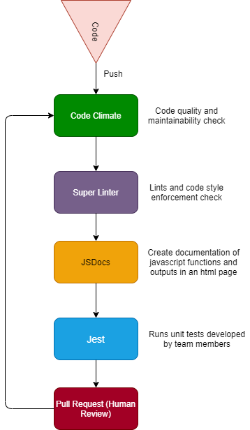

# CI/CD Pipeline Status

## Status
- Currently included every aspect required into the Github workflow
- Some things might need further tweaking but all working according to design
- Deployment needs to still be developed with current options being Heroku and Netlify
- User testing is done throughout with console and live server results
- Everything is checked by the entire team (front end or back end) before any final decisions are made
- In Progress: unit testing for back end functions, deployment and final styling adjustments.

## Code Coverage
- Currently using Code Climate for code maintanability
- Current Maintainability: D 
- Need to refactor utilityFunction.js and main.js for code styling and follow code conventions

## Test Coverage
- Under development
- Teams have been already created
- Testing Team: Nathan, Martin, Parisa, Ayushi, Zhenyi, Sik, Jared, and Presley
- Not sure of testing for front end just yet
- Testing Priorities: CRUD Functionaility, API results, Pixel Testing, DOM iteractions

## Workflow
1. Team member in the repository develops some code regarding the project. (ex. Spoonacular API functions)
2. Team member tests manually functions using console, live server, and etc. 
3. Team member then after getting desired results, commits changes to their working branch.
4. After more development, the team member is now done with their code after numerous user testing attempts.
5. Team member is now ready to create a pull request on Github to merge code into main branch.
6. Other team member reviews and throughly examines the pull request and the code to be pushed into main.
7. During the manual pull request review, Github workflow runs
8. In the Github workflow, Code climate starts for code quality issues (ex. too many lines of code in a function)
9. Next, the Github workflow goes Super Linter from .yml file to check for code styling.
10. After this, the Github workflow runs JSDocs, which then extracts javascript functions by searching for javascript comments and then generates documentation page for that function. Then it creates a html file in a new branch called gh-pages.
11. Once the documentation is generated successfully, Github workflow then checks npm version, installs Jest and Babel, then parses through code to check for unit tests created by team members. If tests are found, then Github workflow runs and checks the tests. If no tests are found, then it automatically passes. 
13. Once reviewed and satisfied, other team member approves the pull request into main and merges it.
14. After merging, team members then check the main branch for any errors or flaws in design that are created once more.
15. Once this is all done, the former branch of the code will then be deleted.

